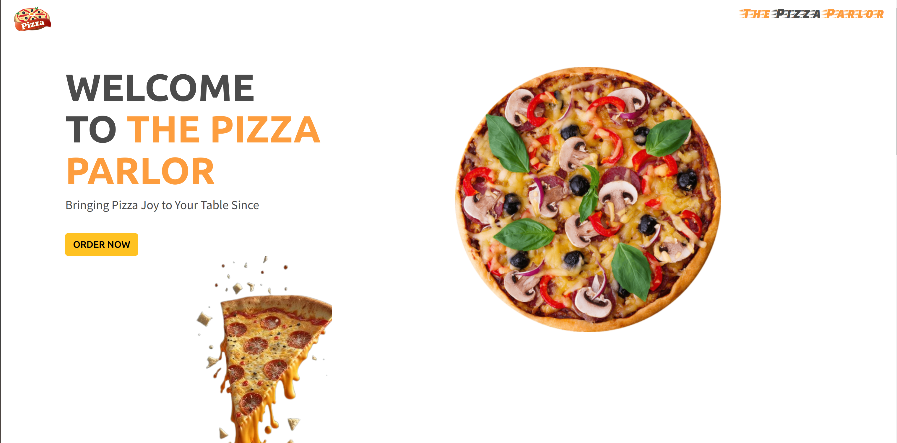

# Pizza Palace

#### Created By Njoroge James Mugo
## Setup Installation
* Copy the github repository url
* Clone to your computer
* Double click the index.html to go live/start your live server
## Technologies Used
 The following languages have been used on this project:
 * HTML
 * CSS
 * Bootstrap
 * Javascript
 * jQuery

## Setup/Installation Requirements

* Live link to view the project <a href="">View The Pizza Parlor</a>
## Some Screenshots
* Homepage

* About section

* Order section

* Add to cart functionality

* Delivery checkout modal functionality
 

* Allowing customers to choose their delivery method

* Success checkout message functionality

* Form validation functionality

* Footer

* Fully responsive

* Succes message for pickup delivery method

## Known Bugs
 So far so good there are no bugs related to this project 😎
## Support and contact details 🙂
To make a contribution to the code used or any suggestions you can click on the contact link and email me your suggestions.
* Email: jamonjoroge816@gmail.com
* Phone: +254 114 049 760

  